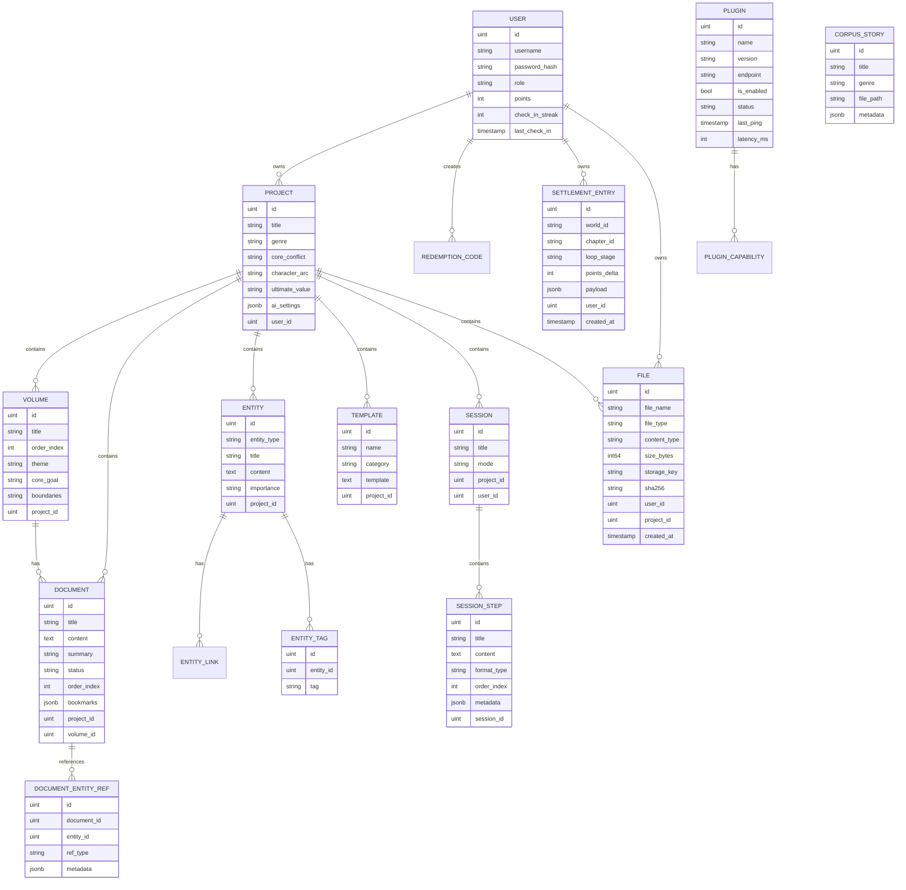

# Novel Agent OS 后端架构设计 - 第一阶段

> 目标：交付可直接上线的统一后端，承载 React 前端从"本地状态"切换到"服务端状态"

---

## 一、架构决策（不可变）

### 1.1 技术栈选择

| 层面 | 技术 | 说明 |
|------|------|------|
| 后端框架 | Go + Gin | 沿用 rulebacktest-main，成熟稳定 |
| ORM | GORM v2 | 支持 Postgres/SQLite 双驱动 |
| 数据库 | SQLite(开发) / Postgres(生产) | 统一 schema，无痛切换 |
| 配置管理 | Viper | 支持多格式、环境变量覆盖 |
| 依赖注入 | Google Wire | 编译时注入，类型安全 |
| 认证 | JWT | Bearer Token，支持角色 |
| 日志 | Zap | 结构化日志，性能优秀 |
| 实时通信 | SSE | 简单、稳定、易调试 |

### 1.2 代码分层规范

```
Router → Handler → Service → Repository → Model
```

| 层级 | 职责 | 禁止行为 |
|------|------|----------|
| Router | 路由注册、中间件应用 | 不写业务逻辑 |
| Handler | 接收请求、参数校验、调用 Service | 不直接操作 DB |
| Service | 业务逻辑、错误转换 | 不写 HTTP 响应 |
| Repository | 数据库 CRUD | 不写业务规则 |
| Model | 数据结构、关联定义 | 无复杂方法 |

---

## 二、数据模型设计

### 2.1 实体关系图



### 2.2 模型详情


#### 用户系统（users）

```go
type User struct {
    BaseModel
    Username      string `gorm:"size:50;uniqueIndex;not null" json:"username"`
    Password      string `gorm:"size:255;not null" json:"-"`
    Nickname      string `gorm:"size:50" json:"nickname"`
    Email         string `gorm:"size:100;uniqueIndex" json:"email"`
    Role          string `gorm:"size:20;default:user" json:"role"` // user/admin
    Status        Status `gorm:"default:1" json:"status"`
    Points        int    `gorm:"default:0" json:"points"`
    CheckInStreak int    `gorm:"default:0" json:"check_in_streak"`
    LastCheckIn   *time.Time `json:"last_check_in"`
}
```


#### 项目系统（projects）


```go
type Project struct {
    BaseModel
    Title         string         `gorm:"size:200;not null" json:"title"`
    Genre         string         `gorm:"size:50" json:"genre"`
    Tags          datatypes.JSON `json:"tags"`
    CoreConflict  string         `gorm:"type:text" json:"core_conflict"`
    CharacterArc  string         `gorm:"type:text" json:"character_arc"`
    UltimateValue string         `gorm:"type:text" json:"ultimate_value"`
    WorldRules    string         `gorm:"type:text" json:"world_rules"`
    AISettings    datatypes.JSON `json:"ai_settings"`
    UserID        uint           `json:"user_id"`
    Volumes       []Volume       `json:"volumes,omitempty"`
    Documents     []Document     `json:"documents,omitempty"`
    Entities      []Entity       `json:"entities,omitempty"`
    Templates     []Template     `json:"templates,omitempty"`
}
```


#### 卷（volumes）


```go
type Volume struct {
    BaseModel
    Title                 string     `gorm:"size:200;not null" json:"title"`
    OrderIndex            int        `json:"order_index"`
    Theme                 string     `gorm:"type:text" json:"theme"`
    CoreGoal              string     `gorm:"type:text" json:"core_goal"`
    Boundaries            string     `gorm:"type:text" json:"boundaries"`
    ChapterLinkageLogic   string     `gorm:"type:text" json:"chapter_linkage_logic"`
    VolumeSpecificSettings string    `gorm:"type:text" json:"volume_specific_settings"`
    PlotRoadmap           string     `gorm:"type:text" json:"plot_roadmap"`
    ProjectID             uint       `json:"project_id"`
    Documents             []Document `json:"documents,omitempty"`
}
```


#### 文档/章节（documents）


```go
type Document struct {
    BaseModel
    Title               string         `gorm:"size:200;not null" json:"title"`
    Content             string         `gorm:"type:text" json:"content"`
    Summary             string         `gorm:"type:text" json:"summary"`
    Status              string         `gorm:"size:20;default:草稿" json:"status"` // 草稿/修改中/完成
    OrderIndex          int            `json:"order_index"`
    Bookmarks           datatypes.JSON `json:"bookmarks"`  // Bookmark[]
    TimeNode            string         `gorm:"size:100" json:"time_node"`
    Duration            string         `gorm:"size:50" json:"duration"`
    TargetWordCount     int            `json:"target_word_count"`
    ChapterGoal         string         `gorm:"type:text" json:"chapter_goal"`
    CorePlot            string         `gorm:"type:text" json:"core_plot"`
    Hook                string         `gorm:"type:text" json:"hook"`
    CauseEffect         string         `gorm:"type:text" json:"cause_effect"`
    ForeshadowingDetails string        `gorm:"type:text" json:"foreshadowing_details"`
    ProjectID           uint           `json:"project_id"`
    VolumeID            uint           `json:"volume_id"`
}

type DocumentEntityRef struct {
    BaseModelWithoutSoftDelete
    DocumentID uint           `gorm:"index;not null" json:"document_id"`
    EntityID   uint           `gorm:"index;not null" json:"entity_id"`
    RefType    string         `gorm:"size:20;default:mention" json:"ref_type"`
    Metadata   datatypes.JSON `json:"metadata"`
}
```


#### 实体/世界观卡（entities）


```go
type Entity struct {
    BaseModel
    EntityType   string         `gorm:"size:20;not null" json:"entity_type"` // character/setting/organization/item/magic/event
    Title        string         `gorm:"size:200;not null" json:"title"`
    Subtitle     string         `gorm:"size:200" json:"subtitle"`
    Content      string         `gorm:"type:text" json:"content"`
    VoiceStyle   string         `gorm:"size:100" json:"voice_style"`
    Importance   string         `gorm:"size:20;default:secondary" json:"importance"` // main/secondary/minor
    CustomFields datatypes.JSON `json:"custom_fields"` // EntityCustomField[]
    ReferenceCount int          `gorm:"default:0" json:"reference_count"`
    ProjectID    uint           `json:"project_id"`
}

type EntityTag struct {
    BaseModelWithoutSoftDelete
    EntityID uint   `gorm:"index;not null" json:"entity_id"`
    Tag      string `gorm:"size:50;index;not null" json:"tag"`
}

// EntityLink 实体关联
type EntityLink struct {
    BaseModelWithoutSoftDelete
    SourceID uint   `json:"source_id"`
    TargetID uint   `json:"target_id"`
    Type     string `gorm:"size:20" json:"type"`
    RelationName string `gorm:"size:50" json:"relation_name"`
}
```


#### AI模板（templates）


```go
type Template struct {
    BaseModel
    Name        string `gorm:"size:100;not null" json:"name"`
    Description string `gorm:"type:text" json:"description"`
    Category    string `gorm:"size:20" json:"category"` // logic/style/content/character
    Template    string `gorm:"type:text" json:"template"`
    ProjectID   uint   `json:"project_id"`
}
```


#### 插件（plugins）


```go
type Plugin struct {
    BaseModel
    Name            string         `gorm:"size:100;not null" json:"name"`
    Version         string         `gorm:"size:20" json:"version"`
    Author          string         `gorm:"size:100" json:"author"`
    Description     string         `gorm:"type:text" json:"description"`
    Endpoint        string         `gorm:"size:500" json:"endpoint"`
    IsEnabled       bool           `gorm:"default:true" json:"is_enabled"`
    Status          string         `gorm:"size:20;default:unknown" json:"status"` // online/offline/error/unknown
    LastPing        *time.Time     `json:"last_ping"`
    LatencyMs       int            `json:"latency_ms"`
    Config          datatypes.JSON `json:"config"`
    Capabilities    []PluginCapability `json:"capabilities,omitempty"`
}

type PluginCapability struct {
    BaseModel
    PluginID    uint   `json:"plugin_id"`
    CapID       string `gorm:"size:50" json:"cap_id"`
    Name        string `gorm:"size:100" json:"name"`
    Type        string `gorm:"size:30" json:"type"` // text_processor/data_provider/ui_extension/logic_checker/generator
    Description string `gorm:"type:text" json:"description"`
    Icon        string `gorm:"size:100" json:"icon"`
}
```


#### 工作流会话（sessions）


```go
type Session struct {
    BaseModel
    Title     string         `gorm:"size:200" json:"title"`
    Mode      string         `gorm:"size:50" json:"mode"` // Normal/Fusion/Single/Batch
    ProjectID uint           `json:"project_id"`
    UserID    uint           `json:"user_id"`
    Steps     []SessionStep  `json:"steps,omitempty"`
}

type SessionStep struct {
    BaseModel
    Title       string         `gorm:"size:200" json:"title"`
    Content     string         `gorm:"type:text" json:"content"`
    FormatType  string         `gorm:"size:50" json:"format_type"`
    OrderIndex  int            `json:"order_index"`
    Metadata    datatypes.JSON `json:"metadata"` // 摘要、字数等
    SessionID   uint           `json:"session_id"`
}
```


#### 结算记录（settlements）


```go
type SettlementEntry struct {
    BaseModel
    WorldID      string         `gorm:"size:100;index;not null" json:"world_id"`
    ChapterID    string         `gorm:"size:100;index;not null" json:"chapter_id"`
    LoopStage    string         `gorm:"size:30;index;not null" json:"loop_stage"`
    PointsDelta  int            `json:"points_delta"`
    Payload      datatypes.JSON `json:"payload"`
    UserID       uint           `gorm:"index;not null" json:"user_id"`
}
```


#### 语料库（corpus_stories）


```go
type CorpusStory struct {
    BaseModel
    Title     string         `gorm:"size:200;not null" json:"title"`
    Genre     string         `gorm:"size:50" json:"genre"`
    FilePath  string         `gorm:"size:500" json:"file_path"`
    FileSize  int64          `json:"file_size"`
    WordCount int            `json:"word_count"`
    Metadata  datatypes.JSON `json:"metadata"`
}
```

#### 文件（files）

```go
type File struct {
    BaseModel
    FileName    string  `gorm:"size:255;not null" json:"file_name"`
    FileType    string  `gorm:"size:20;index;not null" json:"file_type"` // upload/export
    ContentType string  `gorm:"size:100" json:"content_type"`
    SizeBytes   int64   `json:"size_bytes"`
    StorageKey  string  `gorm:"size:500;uniqueIndex;not null" json:"storage_key"`
    SHA256      string  `gorm:"size:64;index" json:"sha256"`
    UserID      uint    `gorm:"index;not null" json:"user_id"`
    ProjectID   *uint   `gorm:"index" json:"project_id"`
}
```


## 三、API 接口规划


### 3.1 认证接口（/api/v1/auth）


| 方法 | 路径 | 描述 | 认证 |
|------|------|------|------|
| POST | /register | 用户注册 | 否 |
| POST | /login | 用户登录 | 否 |
| POST | /logout | 退出登录 | 是 |
| GET  | /refresh | 刷新 Token | 是 |


### 3.2 用户接口（/api/v1/users）


| 方法 | 路径 | 描述 | 角色 |
|------|------|------|------|
| GET  | /profile | 获取当前用户信息 | 任意 |
| PUT  | /profile | 更新用户信息 | 任意 |
| POST | /check-in | 每日签到 | 任意 |
| GET  | /points | 获取积分详情 | 任意 |
| GET  | / | 用户列表(分页) | admin |
| PUT  | /:id/status | 禁用/启用用户 | admin |


### 3.3 项目接口（/api/v1/projects）


| 方法 | 路径 | 描述 |
|------|------|------|
| GET  | / | 项目列表(分页) |
| POST | / | 创建项目 |
| GET  | /:id | 项目详情(含所有子资源) |
| PUT  | /:id | 更新项目 |
| DELETE | /:id | 删除项目(级联) |
| GET  | /:id/export | 导出项目为 JSON |


### 3.4 卷接口（/api/v1/projects/:project_id/volumes）


| 方法 | 路径 | 描述 |
|------|------|------|
| GET  | / | 卷列表 |
| POST | / | 创建卷 |
| GET  | /:id | 卷详情 |
| PUT  | /:id | 更新卷 |
| DELETE | /:id | 删除卷 |
| PUT  | /reorder | 批量调整顺序 |


### 3.5 文档/章节接口（/api/v1/projects/:project_id/documents）


| 方法 | 路径 | 描述 |
|------|------|------|
| GET  | / | 文档列表(支持 volume_id 过滤) |
| POST | / | 创建文档 |
| GET  | /:id | 文档详情 |
| PUT  | /:id | 更新文档 |
| DELETE | /:id | 删除文档 |
| PUT  | /:id/content | 更新内容(自动触发排版检查) |
| GET  | /:id/entities | 获取文档关联实体 |
| POST | /:id/entities | 关联实体到文档 |
| DELETE | /:id/entities/:entity_id | 取消文档关联实体 |


### 3.6 实体接口（/api/v1/projects/:project_id/entities）


| 方法 | 路径 | 描述 |
|------|------|------|
| GET  | / | 实体列表(支持 type/tag 过滤) |
| POST | / | 创建实体 |
| GET  | /:id | 实体详情 |
| PUT  | /:id | 更新实体 |
| DELETE | /:id | 删除实体 |
| POST | /:id/link | 关联实体 |
| DELETE | /:id/link | 取消关联 |


### 3.7 模板接口（/api/v1/projects/:project_id/templates）


| 方法 | 路径 | 描述 |
|------|------|------|
| GET  | / | 模板列表 |
| POST | / | 创建模板 |
| GET  | /:id | 模板详情 |
| PUT  | /:id | 更新模板 |
| DELETE | /:id | 删除模板 |


### 3.8 插件接口（/api/v1/plugins）


| 方法 | 路径 | 描述 | 角色 |
|------|------|------|------|
| GET  | / | 插件列表(含状态) | 任意 |
| POST | / | 注册插件 | admin |
| GET  | /:id | 插件详情 | 任意 |
| PUT  | /:id | 更新插件配置 | admin |
| DELETE | /:id | 删除插件 | admin |
| POST | /:id/enable | 启用插件 | admin |
| POST | /:id/disable | 禁用插件 | admin |
| POST | /:id/ping | 手动探活 | admin |
| POST | /:id/invoke | 调用插件能力 | 任意 |


### 3.9 会话接口（/api/v1/sessions）


| 方法 | 路径 | 描述 |
|------|------|------|
| GET  | / | 会话列表 |
| POST | / | 创建会话 |
| GET  | /:id | 会话详情(含 steps) |
| DELETE | /:id | 删除会话 |
| GET  | /:id/export | 导出为 Markdown |
| GET  | /:id/stream | SSE 实时流 |


### 3.10 会话步骤接口（/api/v1/sessions/:session_id/steps）


| 方法 | 路径 | 描述 |
|------|------|------|
| POST | / | 追加步骤 |
| PUT  | /:id | 更新步骤 |
| DELETE | /:id | 删除步骤 |


### 3.11 结算接口（/api/v1/settlements）


| 方法 | 路径 | 描述 |
|------|------|------|
| GET  | / | 结算列表(支持 world_id/chapter_id 过滤) |
| POST | / | 追加结算条目 |
| GET  | /:id | 结算详情 |
| PUT  | /:id | 更新结算 |
| DELETE | /:id | 删除结算 |
| GET  | /export | 导出为 JSON |


### 3.12 语料接口（/api/v1/corpus）


| 方法 | 路径 | 描述 |
|------|------|------|
| GET  | / | 语料列表(支持 genre 过滤) |
| POST | /upload | 上传语料 |
| GET  | /:id | 语料详情 |
| DELETE | /:id | 删除语料 |
| GET  | /:id/content | 读取内容(分页) |
| POST | /scan | 扫描目录建立索引 |


### 3.13 格式化接口（/api/v1/formatting）


| 方法 | 路径 | 描述 |
|------|------|------|
| POST | /format | 格式化文本(番茄规则) |
| POST | /check | 检查质量门禁 |
| POST | /polish | 润色文本 |

### 3.14 文件接口（/api/v1/files）

| 方法 | 路径 | 描述 |
|------|------|------|
| GET  | / | 文件列表(支持 project_id/file_type 过滤) |
| GET  | /:id | 文件详情 |
| GET  | /:id/download | 下载文件(鉴权) |
| DELETE | /:id | 删除文件(连同存储对象) |


## 四、目录结构


```
miaomiaoji-os/
├── cmd/
│   └── server/
│       ├── main.go              # 程序入口
│       └── bootstrap.go         # 依赖初始化
├── configs/
│   ├── config.yaml              # 本地配置
│   └── config.yaml.example      # 配置模板
├── docs/
│   └── api.md                   # API 文档
├── internal/
│   ├── config/                  # 配置管理
│   │   └── config.go
│   ├── model/                   # 数据模型
│   │   ├── base.go
│   │   ├── user.go
│   │   ├── project.go
│   │   ├── volume.go
│   │   ├── document.go
│   │   ├── entity.go
│   │   ├── template.go
│   │   ├── plugin.go
│   │   ├── session.go
│   │   ├── settlement.go
│   │   ├── corpus.go
│   │   └── file.go
│   ├── repository/              # 数据访问层
│   │   ├── base.go
│   │   ├── user_repository.go
│   │   ├── project_repository.go
│   │   └── ...
│   ├── service/                 # 业务逻辑层
│   │   ├── user_service.go
│   │   ├── project_service.go
│   │   ├── formatting_service.go
│   │   ├── quality_service.go
│   │   └── ...
│   ├── handler/                 # HTTP 处理器
│   │   ├── user_handler.go
│   │   ├── project_handler.go
│   │   ├── session_handler.go
│   │   └── ...
│   ├── router/                  # 路由配置
│   │   └── router.go
│   ├── middleware/              # 中间件
│   │   ├── auth.go
│   │   ├── cors.go
│   │   ├── rate_limit.go
│   │   └── request_id.go
│   └── wire/                    # 依赖注入
│       ├── wire.go
│       └── wire_gen.go
├── pkg/                         # 公共包
│   ├── response/                # 统一响应
│   │   └── response.go
│   ├── errors/                  # 错误码
│   │   └── errors.go
│   ├── logger/                  # 日志
│   │   └── logger.go
│   └── database/                # 数据库连接
│       └── database.go
├── storage/                     # 文件存储(上传/导出)
│   ├── uploads/                 # 上传文件
│   └── exports/                 # 导出文件
├── tests/                       # 测试目录
│   ├── integration/
│   └── unit/
├── go.mod
├── go.sum
├── Makefile
└── README.md
```


---


## 五、关键实现要点


### 5.1 统一响应格式


沿用 rulebacktest-main 规范：


```go
{
    "code": 0,
    "message": "success",
    "data": { }
}
```


分页响应：


```go
{
    "code": 0,
    "message": "success",
    "data": {
        "list": [],
        "total": 100,
        "page": 1,
        "page_size": 10,
        "total_pages": 10
    }
}
```


### 5.2 错误码规范


| 区间 | 说明 |
|------|------|
| 0 | 成功 |
| 10001-10999 | 系统级错误 |
| 20001-20999 | 用户相关错误 |
| 30001-30999 | 项目相关错误 |
| 40001-40999 | 会话/工作流错误 |
| 50001-50999 | 插件错误 |


### 5.3 JWT 中间件


```go
// RequireAuth JWT认证中间件
// 从 Header Authorization: Bearer <token> 提取并验证

// RequireRole 角色权限中间件
// RequireRole("admin") 仅管理员可访问
```


### 5.4 速率限制


```go
// 登录/注册接口：5次/分钟
// 其他接口：100次/分钟
```


### 5.5 SSE 实时通信


```go
// GET /api/v1/sessions/:id/stream
// Content-Type: text/event-stream

// 事件类型：
// - step.appended    步骤追加完成
// - quality.checked  质量门禁检查完成
// - export.ready     导出文件就绪
// - error            错误通知
```


### 5.6 文件处理策略


```go
// 上传限制：
// - 最大文件大小：10MB
// - 允许类型：.txt
// - 存储路径：storage/uploads/corpus/

// 导出策略：
// - 异步生成，完成后通过 SSE 通知
// - 临时文件存储：storage/exports/
// - 定期清理(24小时后)
// - 下载需鉴权
```

```go
type Storage interface {
    Put(ctx context.Context, key string, data io.Reader) error
    Open(ctx context.Context, key string) (io.ReadCloser, error)
    Delete(ctx context.Context, key string) error
}
```


### 5.7 质量门禁(Quality Gate)


```go
// 检查项：
// 1. 非空字符计数
// 2. 段落长度(最大/最小)
// 3. 钩子检测
// 4. 标点半角/全角检查

// 返回：
// {
//     "passed": true/false,
//     "score": 85,
//     "issues": ["段落过长: 第3段"],
//     "word_count": 2250
// }
```


### 5.8 排版引擎(Formatting)


```go
// 基于 tomato_formatting_rules.json 配置：
// 1. 段落首行缩进：　　(两个全角空格)
// 2. 段落间距：\n\n
// 3. 标题格式：第{n}章 {title}
// 4. 标点全角化
// 5. 自动修正省略号

// 策略(可配置)：
// - fix_punctuation
// - break_long_paragraphs
// - remove_redundant_spaces
```


---


## 六、部署配置


### 6.1 开发环境配置文件


```yaml
app:
  name: novel-agent-os-backend
  env: development
  debug: true

server:
  host: 0.0.0.0
  port: 8080
  read_timeout: 30
  write_timeout: 30

database:
  driver: sqlite
  database: data.db
  # driver: postgres
  # host: localhost
  # port: 5432
  # database: novel_os
  # username: postgres
  # password: password

jwt:
  secret: dev-secret-key
  expire_hours: 24

log:
  level: debug
  format: json
  output: stdout

storage:
  upload_max_size: 10485760  # 10MB
  upload_dir: ./storage/uploads
  export_dir: ./storage/exports
  cleanup_interval_hours: 24

cors:
  allowed_origins:
    - http://localhost:5173
    - http://localhost:3000
```


### 6.2 生产环境关键配置


```yaml
app:
  env: production
  debug: false

database:
  driver: postgres
  # 连接池配置
  max_open_conns: 100
  max_idle_conns: 10
  conn_max_lifetime: 3600

jwt:
  secret: ${JWT_SECRET}  # 从环境变量读取
  expire_hours: 168      # 7天

cors:
  allowed_origins:
    - https://novel.yourdomain.com  # 明确白名单，不用 *

storage:
  # 可配置为对象存储(S3/OSS)的代理
  upload_dir: /data/uploads
  export_dir: /data/exports
```


---


## 七、质量门槛(DoD)


### 7.1 功能验收


- [ ] 前端全链路可用：登录→项目→章节→实体→会话→导出
- [ ] 关键接口具备幂等与并发安全
- [ ] 文件上传安全：类型/大小限制、目录隔离


### 7.2 接口契约


- [ ] 所有接口统一响应格式
- [ ] docs/api.md 与实际接口一致


### 7.3 质量门槛


- [ ] go test 全绿
- [ ] go test -race 通过
- [ ] go lint 全绿


### 7.4 安全门槛


- [ ] 不记录密码/JWT 到日志
- [ ] CORS 生产环境明确白名单
- [ ] 管理员接口 RequireRole("admin")


---


## 八、实施步骤总结


```
第1步：工程初始化
  └── 复制 rulebacktest-main 模板
  └── 修改 go.mod 为 novel-agent-os-backend
  └── 配置 config.yaml 双环境
  └── 初始化空服务可运行

第2步：数据模型
  └── 创建所有 model 定义
  └── 实现 AutoMigrate
  └── 本地验证 schema 正确

第3步：认证授权
  └── JWT 中间件
  └── auth handler
  └── rate limit 中间件

第4步：业务 CRUD
  └── projects / volumes / documents / entities / templates
  └── RESTful API 完整

第5步：高级服务
  └── formatting_service (番茄格式)
  └── quality_service (质量门禁)
  └── session_service (会话管理)
  └── settlement_service (结算)
  └── corpus_service (语料)

第6步：实时与文件
  └── SSE 实现
  └── 文件上传/导出

第7步：测试与文档
  └── 接口测试
  └── 更新 api.md
