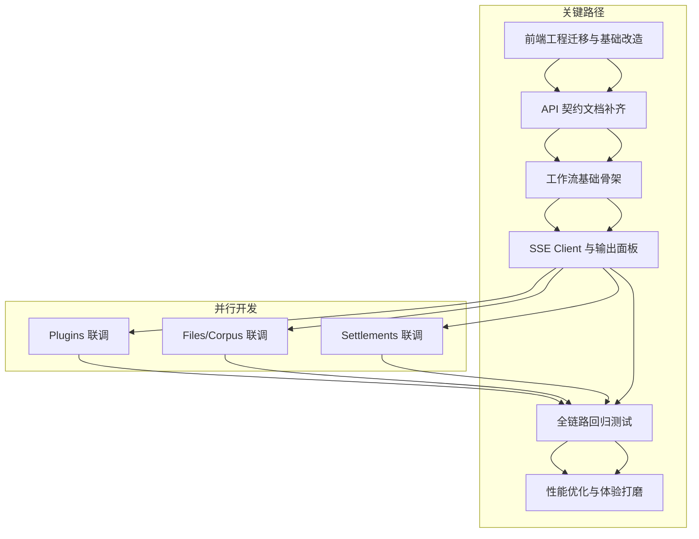
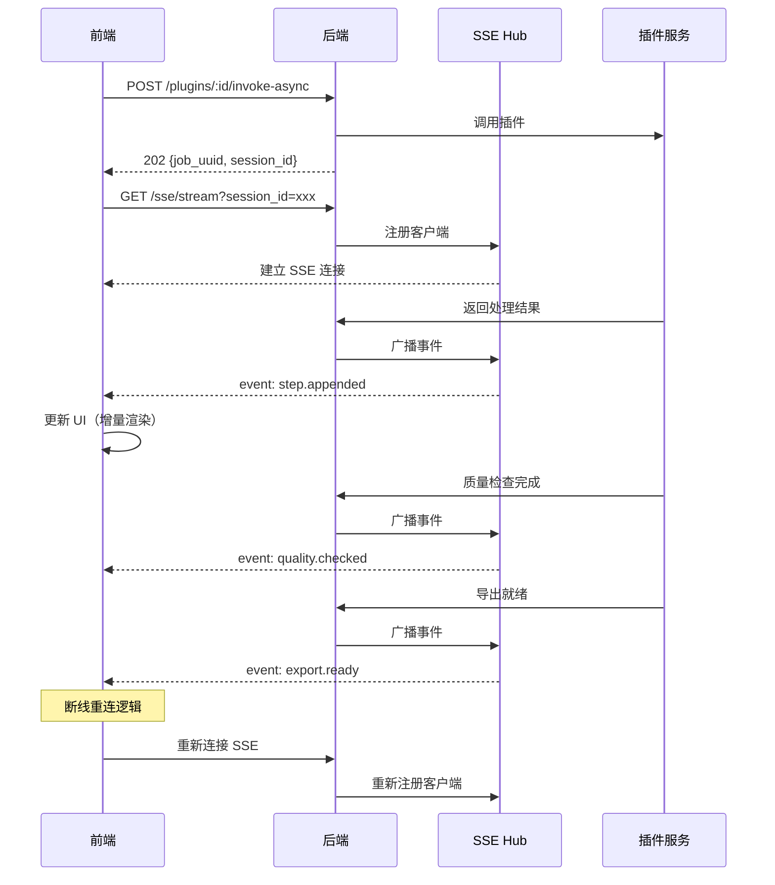
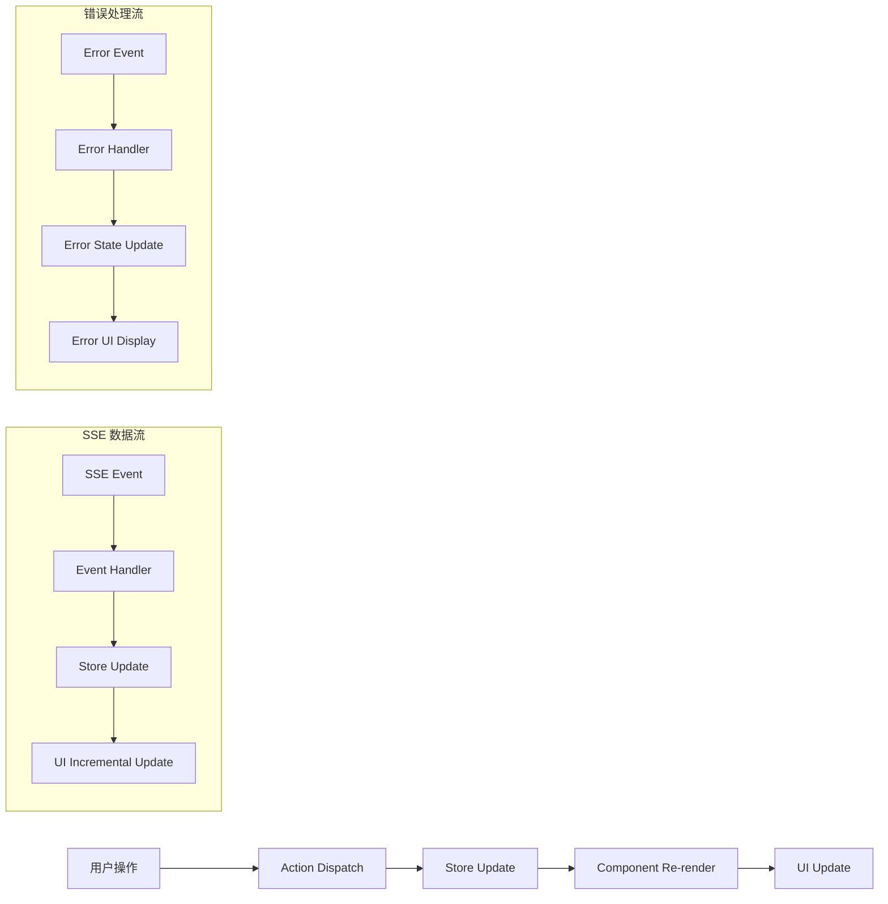

0. 当前信息与关键假设
0.1 后端契约（已确认）
docs/api.md 已包含：

JWT：/api/v1/auth/login|register|refresh|logout
Projects：列表/创建/更新/删除/导出
Plugins：列表/启用禁用/ping/能力/call/invoke-async + Jobs（轮询）
并明确：异步调用可通过 SSE 订阅 session_id 获取进度（见 docs/api.md：异步调用插件/Jobs/SSE 章节）。

补充：本仓库后端已实现 Sessions / Steps / SSE 路由，docs/api.md 已补齐对应章节；联调前仍需要以 internal/router/router.go 与各 handler 的实际请求/响应为最终准绳。
0.2 参考项目里可复用的成熟实现（对标竞品 MuMuAINovel）
在 参考项目/MuMuAINovel-main/frontend 里已有完整的 SSE 工具实现：

src/utils/sseClient.ts：
SSEClient（EventSource GET）
SSEPostClient（fetch POST + ReadableStream 手动解析 event: + data:）
支持 progress/chunk/result/error/done 分类型消息与累计内容 accumulatedContent
这份实现可作为你们 Phase4 的 SSE 客户端与输出面板交互规范参考（尤其是“增量 chunk append”避免全量重排）。
0.3 模板前端现状（需要注意的差异）
你提供的“模板前端参考”（参考项目/1.28-novel-agent-os (5)）是 Vite + React（无路由库、无数据缓存库），并且 Auth/Project 都是 localStorage mock 的 Context，不是对接你们 Go 后端 API 的版本。
因此：M4 的“工作流 + SSE + 配套模块联调”在真正落地时，必须以你们将要采用的“模板前端主工程”当前栈为准（路由/布局/组件库/请求层）。本计划按你在需求里提的“采用模板前端作为主工程”来写，但会把接口与模块拆分讲清楚，便于直接落到工程结构里。

0.4 模板前端主工程路径（当前仓库现状）
目前在主仓库根目录（h:\miaomiaoji-os）及非“参考项目”目录下，未发现前端工程标识（例如 package.json / vite.config.* / next.config.* / index.html 等）。
当前可识别的前端工程均位于：h:\miaomiaoji-os\参考项目\ 下（例如 参考项目/1.28-novel-agent-os (5)）。
结论：在开始第 4 阶段前端建设前，需要先明确“模板前端主工程”要落地到主仓库的哪个目录（例如 /web、/frontend、/ui），并完成拷贝/迁移与基础构建可运行。建议默认落地目录为 /web（目录名统一可减少 AI 误判与重复搭建）。

0.5 Phase4 开工前置（必须先完成，再开始 M4 UI/联调）
模板前端是“起步骨架”，不能直接照搬上线；Phase4 的前置不是“原样迁移”，而是“迁入并完成基础改造后，才进入 M4 UI/联调”。

1) 将“模板前端”迁入主仓库的指定目录，并作为“模板前端主工程”维护（不再仅停留在参考项目目录）。
2) 完成基础改造（先做底座，不等到后面边做功能边返工）：
   - 请求层：把 services/contexts 的 mock 逻辑替换为真实 API Client（统一处理 JWT、错误码、401 刷新/跳转登录）。
   - 鉴权：AuthContext 从 localStorage 账户系统切换为后端 /auth + /users/profile 契约；项目上下文同理切换为 /projects。
   - 路由与布局：补齐路由方案与页面壳（至少能到登录页/项目列表页/工作流页）。
   - 配置：在前端侧提供可配置的 API_BASE_URL（以及需要时的 SSE_BASE_URL），确保非硬编码，便于后续联调与部署切换。
3) 本地可运行：完成依赖安装、开发服务器启动，能在浏览器打开并进入基础页面（至少到登录页或项目列表页）。
4) 最小联调验证：完成一次真实后端联调闭环（登录 → 获取当前用户信息 /users/profile 或拉取项目列表 /projects）。
5) 同步核对后端契约文档：确保 docs/api.md 与 internal/router/router.go、各 handler 的请求/响应保持一致（以代码为准）。

0.6 AI 协作强约束：前端必须复用模板（禁止另起炉灶）
目的：避免 AI 自行搭建“第二套前端工程/第二套组件库/第二套路由与请求层”，导致目录混乱、风格不一致、联调成本暴增。

硬约束（必须遵守）
- 只允许在“模板前端主工程目录”内工作（建议 /web）；禁止在仓库根目录或其它目录新建前端工程（例如新增 package.json、vite.config.*、next.config.*、src/ 等）。
- 禁止引入新的前端框架或脚手架（例如 Next.js、Umi、Angular、Vue），禁止把 Vite+React 替换为其它栈。
- 禁止“重写一套”Auth/Projects/HTTP Client/SSE Client：必须以模板现有目录结构与实现为底座改造（允许重构，但必须在原工程内完成，且保留可运行状态）。
- 禁止在“参考项目/”目录里直接开发交付；参考项目只用于对照与拷贝（复制粘贴到 /web 后再改造）。

允许范围（在模板内做的改造）
- 将模板中基于 localStorage/mock 的 Auth/Project/服务层替换为真实后端 API（不改变页面 IA 与组件复用策略）。
- 按需补齐模板缺失的路由方案、页面壳、请求层与 SSE 适配器，但必须与模板已有代码风格、状态管理方式一致。
- 允许新增少量必要依赖，但必须满足“最小增量”：优先复用模板已有库；新增依赖必须直接服务于联调闭环（例如路由库、SSE stream 解析）。

验收标准（DoD：用于判断是否“确实复用模板”）
- 仓库内仅存在一个被维护的前端主工程目录（建议 /web），且能独立安装依赖并启动开发服务器。
- 未出现第二套前端入口/构建体系（例如新增 next.config.*、另一个 package.json、另一个 vite.config.*）。
- 页面与组件均落在模板工程内，且沿用模板既有 UI/布局体系（不是重新做一套全新 UI）。
- 至少完成一次真实联调闭环：登录 → /users/profile → /projects 列表（或任一后端真实接口闭环）。

0.7 模板与后端不匹配点：差异清单与改造顺序（必须先做）
背景：模板是“前端优先”的骨架，默认用 mock 数据与 localStorage Context；后端是“统一响应 + JWT + 分页参数差异 + SSE 鉴权约束”。不先做底座改造，后续工作流/SSE 会被反复返工。

差异清单（常见踩坑）
- 统一响应格式：后端统一返回 {code,message,data}；分页通常在 data.page_info，但部分接口（例如 plugins/sessions）使用 data.{plugins|sessions,total,page,page_size}。前端需要在 API Client 层做统一 unwrap/normalize。
- 鉴权：后端使用 JWT Bearer Token；401 需要走 /api/v1/auth/refresh 刷新，失败则清空 token 并跳转登录。
- 项目与会话：模板的 Project/Session 可能是本地 mock；后端为 /api/v1/projects 与 /api/v1/sessions（分页参数与字段以 docs/api.md 为准）。
- SSE 鉴权与参数：订阅端点为 GET /api/v1/sse/stream?session_id=xxx 且受 JWTAuth 保护；EventSource 不支持自定义 Authorization header，若必须走 Bearer Header，则需要 fetch + ReadableStream 解析 SSE。
- SSE 事件类型：step.appended / quality.checked / export.ready / error（事件体为 {type,data,timestamp}）。前端输出面板需支持增量追加（chunk append），并在断线重连时保留已累积内容。
- CORS/同域策略：若前后端分域，需确认 CORS、Cookie/Authorization 传递策略与 SSE 是否可用（尤其是 EventSource 的跨域限制）。

改造顺序（强烈建议按顺序推进，避免边做业务边返工）
1) 固化“模板前端主工程目录”（建议 /web）并确保可运行（npm install + dev server）。
2) 配置层：引入 API_BASE_URL/SSE_BASE_URL 等环境变量读取方案，禁止硬编码。
3) 请求层：实现统一 API Client（自动注入 Authorization、统一处理 code/message/data、401 自动 refresh）。
4) Auth：将模板 AuthContext/mock 替换为对接 /api/v1/auth/login|register|refresh|logout + /api/v1/users/profile 的真实流程。
5) Projects：将模板项目列表/详情的 mock 替换为 /api/v1/projects 的真实接口（先做列表即可）。
6) SSE：实现 Stream Adapter（EventSource + fetch-stream 两套适配），上层对外暴露一致事件回调，再接入工作流输出面板。

1. M4 交付范围（In Scope）与不做项（Out Scope）
1.1 M4 必交付（功能闭环）
工作流模块（核心）
Sessions 列表页：可筛选/分页/查看状态（running/success/failed/canceled）
Session 详情页：
Steps 树/列表（按顺序、可折叠、定位）
运行态输出面板（流式）
历史回看（已完成 session 可回放 steps 与输出）
失败重试（按 session 或按 step 的“重跑”入口，具体以接口为准）
SSE 流式输出（核心）
连接/断线/重连策略
心跳/超时提示（前端层）
增量渲染（append chunk，不频繁 setState 全量替换）
输出能力：复制、折叠、按步骤定位、错误提示与重试
配套模块最小可用联调（MVP）
Plugins：列表 + 启用/禁用 + ping/健康/延迟展示（以现有接口为准）
Files：上传/列表/下载（预览可按类型占位）
Corpus：列表/导入入口（占位到可用）
Settlements：积分流水列表 + 当前积分展示（读接口即可）
Export：项目导出入口（下载 JSON 或跳转导出页）
全链路回归（DoD 跑通）
从“创建项目”开始，进入写作（卷/章节）、编辑内容、建立/编辑资料卡、运行工作流（SSE 输出）、最终导出项目。
1.2 M4 明确不做（保持边界）
复杂协作（多人实时编辑）
第三方支付
深度主题系统（允许仅保留轻量暗黑/亮色切换）
模型训练相关
2. 信息架构落地（M4 需要新增/补齐的页面）
在你给定的全局 IA 基础上，M4 的重点是把 “工作流” 与 “配套模块” 完整补齐到可用。

2.1 路由/页面清单（建议）
/workflows：会话列表（Sessions）
/workflows/:sessionId：会话详情（Steps + Output）
/plugins：插件中心
/files：文件与上传
/corpus：语料（列表 + 导入入口）
/settlements：积分流水
/projects/:project_id/export 或 /projects/:project_id 内的导出面板
2.2 页面布局（推荐交互）
左侧主导航固定（项目/写作/资料卡/模板/工作流/插件/文件与语料/结算/设置）
工作流详情页采用“三栏”或“两栏”：
左：Step 树
中：输出（stream）
右：本次运行参数/元信息/结果归档入口（可折叠）
3. 技术方案（M4 专项）
3.1 SSE 客户端策略（核心）
首选：EventSource（GET SSE）

优点：浏览器原生、自动重连、简单
难点：自定义 header 不方便（带 JWT 常见问题）
解决策略（结合本后端实现）：
1) 本仓库 SSE 订阅端点为：GET /api/v1/sse/stream（internal/router/router.go:247-252）
   - 认证：JWTAuth 中间件（同域/跨域取决于部署与 CORS）
   - 订阅参数：session_id（query，必填，internal/handler/sse_handler.go:24-29）
2) EventSource 无法自定义 Authorization header：
   - 若前端 Token 仅以 Bearer Header 方式注入，则需要后端同时支持 Cookie 鉴权，或前端采用 fetch-stream（ReadableStream）方式带 header。
   - 当前后端 sse_handler.go 中 Stream 路由已挂 middleware.JWTAuth()，意味着服务端期望正常走 JWT 校验；前端需在工程落地时明确鉴权承载方式。
3) 建议前端实现“Stream Adapter”，同时支持：
   - EventSourceAdapter：适用于 cookie/同域等可用场景
   - FetchStreamAdapter：适用于必须携带 Authorization header 的场景
EventSourceAdapter：处理 GET SSE
FetchStreamAdapter：处理 POST/需要 header 的 SSE
上层对外暴露统一事件：onProgress/onChunk/onResult/onError/onDone
3.2 断线重连与超时体验（DoD 必须覆盖）
“连接中 / 已连接 / 已断开（可重试）/ 重连中”四态
重连退避：指数退避 + jitter，上限例如 30s（避免风暴）
心跳：如果后端不发心跳，前端需“超时检测”（例如 N 秒无任何 event 视为 stalled，提示用户“连接卡住，尝试重连”）
断线可恢复：保持已累计输出，不因断线清空 UI
3.3 流式渲染性能（避免大文本卡顿）
输出按“Step → 输出块（chunks）”分桶存储
UI 渲染只追加新 chunk（不要每次把全文拼接后 setState）
对输出区启用：
只在可见区域渲染（长输出可分页/虚拟化，或“折叠已完成步骤”减少 DOM）
使用 requestAnimationFrame/批处理节流：例如每 50–100ms flush 一次渲染队列
提供“暂停自动滚动 / 跳到底部”开关，避免用户回看时被强制拉走
3.4 与 Jobs/异步调用的联动（基于 api.md 已存在）
plugins/:id/invoke-async 返回 job_uuid（202 Accepted）
前端策略：
立刻在 Session 详情页创建“运行态卡片”
以 session_id 作为主锚：
SSE（优先）订阅 session 输出
Jobs（fallback）轮询 job 状态（断线或 SSE 不可用时）
“失败重试”策略：
失败时保留失败原因与最后输出位置
“重试”应产生新的 job/session（避免覆盖历史审计）
4. M4 任务拆解（按交付物组织）
4.1 工作流（Sessions + Steps）
交付物

Sessions List：分页、状态筛选、进入详情
Session Detail：
Steps 树（包含状态：queued/running/success/error）
选中 Step 时输出区定位
“运行中”与“已完成”两种视图（运行中自动更新）
接口依赖（以本仓库后端路由为准；建议后续同步补齐到 docs/api.md）

Sessions（internal/router/router.go:230-245）
- POST   /api/v1/sessions                 CreateSession
- GET    /api/v1/sessions                 ListSessions
- GET    /api/v1/sessions/:session_id     GetSession
- PUT    /api/v1/sessions/:session_id     UpdateSession
- DELETE /api/v1/sessions/:session_id     DeleteSession

Session Steps（internal/router/router.go:239-244）
- POST   /api/v1/sessions/:session_id/steps  CreateStep
- GET    /api/v1/sessions/:session_id/steps  ListSteps
- GET    /api/v1/sessions/steps/:id          GetStep
- PUT    /api/v1/sessions/steps/:id          UpdateStep
- DELETE /api/v1/sessions/steps/:id          DeleteStep

SSE（internal/router/router.go:247-252）
- GET  /api/v1/sse/stream   Stream（query: session_id 必填）
- POST /api/v1/sse/test     BroadcastTestEvent（用于测试广播；同样需要 query: session_id）

备注：session_handler.go 中存在 ListSessionsByProject，但路由未注册（当前 router.go 未暴露 /projects/:project_id/sessions 之类的 endpoint）。如果前端需要“项目维度会话列表”，建议后端补路由或前端先用 ListSessions 后自行按 project_id 过滤（性能取决于数据量）。

字段映射（用于前端模型与表单）
- CreateSessionRequest（internal/handler/session_handler.go:23-27）: title(required), mode(required), project_id(required)
- UpdateSessionRequest（internal/handler/session_handler.go:29-32）: title?, mode?
- CreateStepRequest（internal/handler/session_handler.go:34-39）: title(required), content?, format_type?, order_index?
- UpdateStepRequest（internal/handler/session_handler.go:41-46）: title?, content?, format_type?, order_index?

数据模型（internal/model/session.go）
- Session: id, title, mode, project_id, user_id, steps[]
- SessionStep: id, title, content, format_type, order_index, metadata(JSON), session_id

4.2 SSE 输出面板（Streaming Output Panel）
交付物

输出区域组件：支持
流式追加、复制、折叠
按 Step 分组
错误态（包含错误码/消息）+ 重试按钮
断线提示 + 立即重连
输出格式：
默认纯文本（最稳定）
若有 markdown：需要做渲染隔离与增量策略（避免每次重排整个 markdown AST）
4.3 Plugins 页面（联调）
交付物

插件列表（分页）
启用/禁用按钮（loading/禁用态）
ping 按钮与展示 healthy/latency_ms（以接口字段为准）
插件详情（可选）：展示 capabilities + invoke 入口（可跳到工作流创建页）
4.4 Files / Corpus（联调）
Files

上传（限制大小来自 env/config）
列表 + 下载
预览：图片/文本可做基础预览，其它类型显示占位
Corpus

列表（本仓库后端已实现 corpus 路由：internal/router/router.go:266-276）
导入入口（占位到可用：上传文件 → 触发后端导入任务 → 绑定 session/job 展示进度）

Files（本仓库后端已实现 files 路由：internal/router/router.go:278-288）
- POST /api/v1/files
- GET  /api/v1/files
- GET  /api/v1/files/project/:project_id
- GET  /api/v1/files/:id
- GET  /api/v1/files/:id/download
- PUT  /api/v1/files/:id
- DELETE /api/v1/files/:id

Formatting / Quality（与“工作流结果处理”联动的后端能力）
- POST /api/v1/formatting/format
- GET  /api/v1/formatting/styles
- POST /api/v1/quality/check
- GET  /api/v1/quality/thresholds
4.5 Settlements（联调）
当前积分展示（来自 /users/points）
积分流水列表（本仓库后端已实现 settlements 路由：internal/router/router.go:254-263）
- POST /api/v1/settlements
- GET  /api/v1/settlements
- GET  /api/v1/settlements/filter
- GET  /api/v1/settlements/total-points
- GET  /api/v1/settlements/:id
- PUT  /api/v1/settlements/:id
- DELETE /api/v1/settlements/:id
4.6 Export（联调）
在项目页提供“导出”入口
GET /api/v1/projects/:project_id/export：下载 JSON（或展示 JSON 再下载）
导出完成后提示：文件名、大小、时间
5. 环境配置与工程规范（M4 必须落地）
5.1 配置项（不硬编码）
API_BASE_URL
SSE_BASE_URL（如不同域/不同前缀）
UPLOAD_MAX_SIZE_MB
SSE_CONNECT_TIMEOUT_MS、SSE_IDLE_TIMEOUT_MS、SSE_MAX_RETRY_MS
ENABLE_MARKDOWN_OUTPUT（可选开关）
5.2 API Client（统一错误与 401/refresh）
所有请求自动带 Authorization: Bearer <token>
401：
先走 refresh（GET /api/v1/auth/refresh）
refresh 失败 → 清空 token → 跳转登录页 → 提示“登录已过期”
错误规范化：将 code/message/data 统一到前端错误对象，页面按空/错态显示
6. 质量门禁（DoD Checklist，M4 阶段验收口径）
6.1 功能验收
Sessions 列表可用，详情可用，Steps 可定位
SSE 运行态流式输出可实时展示，断线可恢复
Plugins/Files/Corpus/Settlements/Export 都有可用 UI 与最小联调链路
全链路回归跑通：创建项目 → 写作 → 资料卡 → 工作流生成 → 导出
6.2 稳定性验收（必须可演示）
Token 过期：自动刷新或明确提示重新登录
SSE 中断：有断线提示、可手动重连、不会清空已有输出
保存失败/网络失败：有明确错误态与恢复路径（重试/返回）
6.3 性能验收（可接受即可）
长列表（章节/实体/文件）：滚动不卡顿（需要虚拟化或 DOM 控制策略）
大文本输出：追加渲染不卡顿（chunk flush + 折叠完成 step）
路由级代码分割（至少工作流/编辑器/插件中心做到懒加载）
7. 风险与对策（M4 特有）
SSE 鉴权与跨域
风险：EventSource 不支持自定义 header，跨域 CORS/认证容易踩坑
对策：本仓库 SSE 路由已挂 JWTAuth 中间件，前端需要明确 SSE 鉴权承载方式：
- 若走 Cookie：确认同域/跨域 withCredentials 与 CORS
- 若走 Bearer Header：建议使用 fetch-stream 解析 SSE（可参考对标项目 MuMuAINovel 的 SSEPostClient 思路）
大文本/长输出导致 UI 卡顿
风险：每次 setState 拼接全文导致频繁重排
对策：chunk 队列 + 批量 flush；按 step 分组折叠；必要时输出区虚拟化/分页
Sessions/Steps 契约不完整
风险：前端只能占位，联调失败
对策：M4 开始前先完成 api.md 中 sessions/steps/sse 路径与 payload 的契约补齐（只更新现有 docs/api.md）
8. “第 4 周交付节奏”（建议按 5 个工作日）
D1：工作流基础骨架
Sessions 列表/详情页路由与布局
Step 树组件骨架（mock 数据先通）
D2：SSE Client 与输出面板
完成 Stream Adapter（EventSource + fetch-stream）
输出面板：chunk append、断线态、复制/折叠
D3：联调 Plugins + Jobs fallback
插件列表 + enable/disable + ping
invoke-async → job 轮询 fallback → 绑定 session 输出
D4：Files/Corpus/Settlements/Export 最小可用
文件上传/列表/下载
语料列表/导入入口（占位到可用）
积分/流水、导出入口
D5：全链路回归与体验修补
空/错/加载态补齐
性能与交互打磨（自动滚动、重连、重试）
最终验收脚本（可手动走通一遍）

补充更新（已核对后端代码，供前端第 4 阶段对照）
1) Sessions / Steps / SSE 路由：internal/router/router.go
2) SSE 订阅参数：session_id（query 必填），internal/handler/sse_handler.go:24-29
3) SSE 事件格式：event: <type>\ndata: <json>\n\n，pkg/sse/sse.go:163-171
4) SSE 事件类型（pkg/sse/sse.go:14-19）：
   - step.appended
   - quality.checked
   - export.ready
   - error

联调注意
- pkg/sse.NewErrorEvent 当前会直接调用 err.Error()，若 err 为 nil 会触发 panic；sse_handler.go:99 默认分支 NewErrorEvent("Unknown event type", nil) 存在潜在问题。
- 建议联调时优先使用 type=step/quality/export，或先修复后端 NewErrorEvent 的 nil 安全性。

## 9. 任务依赖关系图



**依赖关系说明：**

| 任务 | 前置依赖 | 并行任务 | 后续任务 |
|------|---------|---------|---------|
| 前端工程迁移 | 无 | 无 | API 契约补齐 |
| API 契约补齐 | 前端工程迁移 | 无 | 工作流骨架 |
| 工作流骨架 | API 契约补齐 | 无 | SSE Client |
| SSE Client | 工作流骨架 | 无 | 配套模块联调 |
| Plugins 联调 | SSE Client | Files/Corpus/Settlements | 全链路测试 |
| Files/Corpus 联调 | SSE Client | Plugins/Settlements | 全链路测试 |
| Settlements 联调 | SSE Client | Plugins/Files/Corpus | 全链路测试 |
| 全链路测试 | 所有联调完成 | 无 | 性能优化 |
| 性能优化 | 全链路测试 | 无 | 无 |

## 10. 资源估算与优先级

### 10.1 任务优先级矩阵

| 优先级 | 任务 | 工作量（人日） | 风险等级 | 业务价值 |
|--------|------|---------------|----------|----------|
| P0 | 前端工程迁移与基础改造 | 3 | 高 | 高 |
| P0 | API 契约文档补齐 | 1 | 中 | 高 |
| P0 | 工作流基础骨架 | 2 | 中 | 高 |
| P0 | SSE Client 与输出面板 | 3 | 高 | 高 |
| P1 | Plugins 联调 | 2 | 中 | 高 |
| P1 | Files/Corpus 联调 | 2 | 低 | 中 |
| P1 | Settlements 联调 | 1 | 低 | 中 |
| P1 | 全链路回归测试 | 2 | 中 | 高 |
| P2 | 性能优化与体验打磨 | 2 | 低 | 中 |

### 10.2 资源分配建议

**总工作量：** 18 人日（约 3.6 周，按 1 人计算）

**关键路径：** 前端迁移 → API 补齐 → 工作流骨架 → SSE Client → 全链路测试 → 性能优化（11 人日）

**并行开发机会：** Plugins/Files/Settlements 可并行开发（节省 2 人日）

**实际交付周期：** 16 人日（约 3.2 周）

## 11. 技术选型对比表

### 11.1 SSE 客户端策略对比

| 方案 | EventSource | Fetch + ReadableStream |
|------|-------------|------------------------|
| **实现复杂度** | 简单 | 中等 |
| **浏览器兼容性** | 优秀（IE 不支持） | 良好（需 polyfill） |
| **自定义 Header** | 不支持 | 完全支持 |
| **自动重连** | 内置 | 需手动实现 |
| **错误处理** | 基础 | 完全可控 |
| **性能** | 优秀 | 良好 |
| **调试友好度** | 一般 | 优秀 |
| **适用场景** | 同域/Cookie 认证 | 跨域/Token 认证 |

**推荐方案：** 混合策略（Stream Adapter 模式）
- 优先使用 EventSource（简单场景）
- 降级到 Fetch Stream（需要 Header 场景）

### 11.2 状态管理方案对比

| 方案 | Context + useReducer | Zustand | Redux Toolkit |
|------|---------------------|---------|---------------|
| **学习成本** | 低 | 低 | 中 |
| **包大小** | 0KB | 2.5KB | 12KB |
| **TypeScript 支持** | 良好 | 优秀 | 优秀 |
| **开发体验** | 一般 | 优秀 | 优秀 |
| **性能** | 一般 | 优秀 | 优秀 |
| **生态** | React 内置 | 中等 | 丰富 |

**推荐方案：** Zustand（轻量、易用、性能好）

## 12. 数据流设计图

### 12.1 SSE 流式输出数据流



### 12.2 前端状态管理数据流



## 13. 错误处理策略矩阵

### 13.1 错误分类与处理策略

| 错误类型 | 错误场景 | 处理策略 | 用户体验 | 恢复方案 |
|----------|----------|----------|----------|----------|
| **网络错误** | 请求超时 | 自动重试 3 次 | 显示重试中 | 手动重试按钮 |
| **网络错误** | 连接失败 | 指数退避重连 | 显示离线状态 | 网络恢复自动重连 |
| **认证错误** | Token 过期 | 自动刷新 Token | 无感知 | 刷新失败跳转登录 |
| **认证错误** | 无权限 | 显示错误信息 | 403 错误页 | 联系管理员 |
| **SSE 错误** | 连接断开 | 自动重连 | 显示断线提示 | 保持已有输出 |
| **SSE 错误** | 事件解析失败 | 记录日志，继续监听 | 跳过错误事件 | 不影响后续事件 |
| **业务错误** | 插件调用失败 | 显示错误详情 | 错误状态 + 重试 | 重新调用插件 |
| **业务错误** | 文件上传失败 | 显示错误原因 | 上传失败提示 | 重新选择文件 |
| **系统错误** | 服务器 500 | 显示通用错误 | 系统繁忙提示 | 稍后重试 |

### 13.2 错误处理代码模式

```typescript
// 统一错误处理器
interface ErrorHandler {
  handleNetworkError(error: NetworkError): void;
  handleAuthError(error: AuthError): void;
  handleSSEError(error: SSEError): void;
  handleBusinessError(error: BusinessError): void;
}

// 错误恢复策略
interface RecoveryStrategy {
  canRecover(error: Error): boolean;
  recover(error: Error): Promise<void>;
  getRetryDelay(attempt: number): number;
}
```
